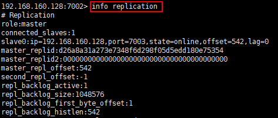

# Redis Cluster

以單機架設為例，之後若有多機可部署，再記錄多機的差異部分

適用redis 5.0以上的版本

redis 5.0以下的版本需安裝ruby

# 下載及安裝

請參考之前的文檔

https://github.com/IvesShe/RedisStudy
# 建立集群資料夾


# 拷貝redis.conf文件

```bash
find / -name redis.conf
```


```bash
cp /usr/local/src/redis-5.0.8/redis.conf /usr/local/myredis/redis7000
```


# 修改redis7000的redis.conf

```bash
vi redis.conf
```


相關配置說明可以參考「redis中文.conf」

修改以下地方

```bash
bind 127.0.0.1

# 修改成自己機器的ip

bind 192.168.160.128
```


```bash
port 6379

# 修改對應的端口

port 7000
```


```bash
daemonize no

# 修改為

daemonize yes
```

```bash
pidfile /var/run/redis_6379.pid

# 修改為

pidfile /var/run/redis_7000.pid
```

```bash
dir ./

# 修改為

dir /usr/local/myredis/redis7000
```

以下注釋需解除

```bash
# cluster-enabled yes

# 修改為

cluster-enabled yes
```

```bash
# cluster-config-file nodes-6379.conf

# 修改為

cluster-config-file nodes-7000.conf
```

```bash
# cluster-replica-validity-factor 10

# 修改為

cluster-replica-validity-factor 10
```

```bash
# cluster-replica-no-failover no

# 修改為

cluster-replica-no-failover no
```

```bash
# cluster-require-full-coverage yes

# 修改為

cluster-require-full-coverage yes
```


# 拷貝並修改redis7000.conf至redis7001-redis7007.conf

```bash
sed 's/7000/7001/g' redis7000/redis.conf > ./redis7001/redis.conf
sed 's/7000/7002/g' redis7000/redis.conf > ./redis7002/redis.conf
sed 's/7000/7003/g' redis7000/redis.conf > ./redis7003/redis.conf
sed 's/7000/7004/g' redis7000/redis.conf > ./redis7004/redis.conf
sed 's/7000/7005/g' redis7000/redis.conf > ./redis7005/redis.conf
sed 's/7000/7006/g' redis7000/redis.conf > ./redis7006/redis.conf
sed 's/7000/7007/g' redis7000/redis.conf > ./redis7007/redis.conf
```


# 啟動所有redis

```bash
/usr/local/bin/redis-server /usr/local/myredis/redis7000/redis.conf
/usr/local/bin/redis-server /usr/local/myredis/redis7001/redis.conf
/usr/local/bin/redis-server /usr/local/myredis/redis7002/redis.conf
/usr/local/bin/redis-server /usr/local/myredis/redis7003/redis.conf
/usr/local/bin/redis-server /usr/local/myredis/redis7004/redis.conf
/usr/local/bin/redis-server /usr/local/myredis/redis7005/redis.conf
/usr/local/bin/redis-server /usr/local/myredis/redis7006/redis.conf
/usr/local/bin/redis-server /usr/local/myredis/redis7007/redis.conf
```


# 分配槽位及主從

這裡只配置7000-7005共6台，1主1從

```bash
/usr/local/bin/redis-cli --cluster create 192.168.160.128:7000 192.168.160.128:7001 192.168.160.128:7002 192.168.160.128:7003 192.168.160.128:7004 192.168.160.128:7005 --cluster-replicas 1
```


--cluster-replicas 1 -> 數字1代表分配比例 主1:從1
--cluster-replicas 2 -> 數字2代表分配比例 主1:從2

# 連接測試

要記得加上-c

```bash
/usr/local/bin/redis-cli -h 192.168.160.128 -p 7000 -c
set k1 v1
get k1
```

發現會被自動轉到對應的槽位


# 查看集群信息

```bash
info replication
```



集群重要指令

```bash
cluster nodes
```


# 槽位

槽位16384，0-16383默認情況下會平均分配


槽位分配簡易示意

crc16(key) = N % 16384 = n

# redis-cli

查看cluster指令

```bash
/usr/local/bin/redis-cli --cluster help
```


# 在原集群(7000-7005)，增加新的機器(擴容集群)

指令可查找help，其中的add-node即是

add-node 要加入的機器 集群任一機器

```bash
/usr/local/bin/redis-cli --cluster add-node 192.168.160.128:7006 192.168.160.128:7000
```


# 在7006查看

```bash
/usr/local/bin/redis-cli -h 192.168.160.128 -p 7006 -c
cluster nodes
```

新加入的機器，默認是master


# 再將7007加入集群

將7007加入集群，並加入參數，使其為從機，並指定它的主機為7006，參數可用cluster help查看

--cluster-slave -> 指定為從機
--cluster-master-id 主機id -> 指定主機

```bash
/usr/local/bin/redis-cli --cluster add-node 192.168.160.128:7007 192.168.160.128:7000 --cluster-slave --cluster-master-id d04fd382b4fb3dac6b2391041542b409a5cf5a58
```


# 再次查看

```bash
/usr/local/bin/redis-cli -h 192.168.160.128 -p 7000 -c
```

```bash
cluster nodes
```


主從都指派完成，但目前7006並沒有槽位

# 給7006分配槽位


--cluster reshard 集群中任一機器位址

```bash
/usr/local/bin/redis-cli --cluster reshard 192.168.160.128:7006
```

給7006分派500個槽位，從7000及7001身上取出槽位


# 再進入查看

```bash
/usr/local/bin/redis-cli -h 192.168.160.128 -p 7000 -c
```

```bash
cluster nodes
```


7006已被分配槽位，且槽位是從7000及7001平均取得(各取250個槽位)

# 集群縮容

之後有需要再操作

# 名詞記錄

## 緩存雪崩

同一時間點，大量的kye同時過期，在這時間點有大量向服務器請求這些過期大量key的請求服務，redis緩存無法命中該key，只好轉向數據庫請求，數據庫短期無法應付如此大的請求量，造成崩潰，服務器在等待數據庫的回應，因為數據庫已經崩潰了，所以服務器也無法回應客戶端的請求，於是造成崩潰。
## 緩存擊穿

同一時間點，熱門的少數kye過期，在這時間點有大量向服務器請求該熱門少數key的請求服務，redis緩存無法命中該key，只好轉向數據庫請求，數據庫短期無法應付如此大的請求量，造成崩潰，服務器在等待數據庫的回應，因為數據庫已經崩潰了，所以服務器也無法回應客戶端的請求，於是造成崩潰。

## 緩存穿透

在同一時間點，有大量不合法的key請求，redis因為沒有這些key，所以不可能命中，服務器轉向數據庫請求，造成數據庫壓力過大崩潰，服務器因為得不到回應也接著崩潰。